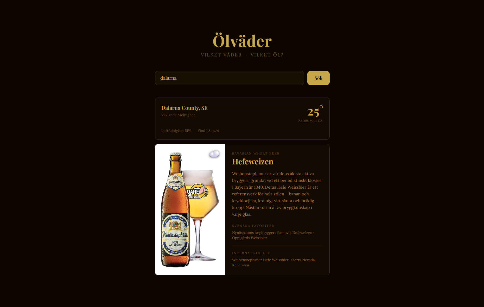
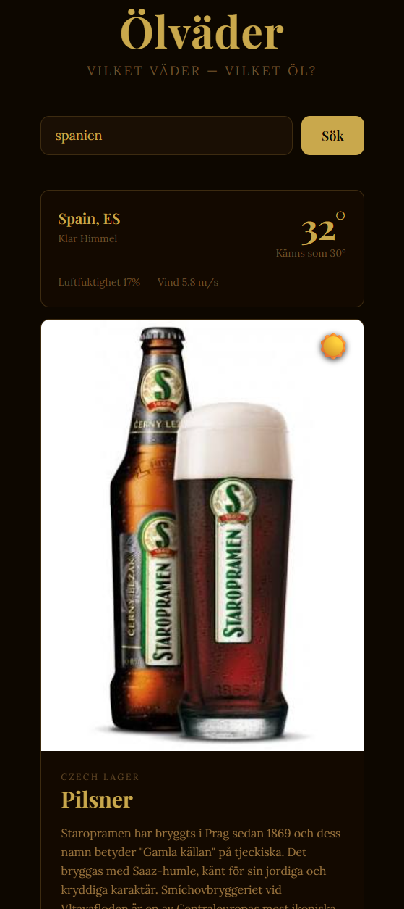

# Olvader

> En vaederapp som rekommenderar ratt ol baserat pa vaedret dar du ar.

<div align="center">
  
</div>

<br />

<div align="center">
  
</div>

---

## Hur det fungerar

Skriv in en stad. Appen haemtar aktuellt vaeder via OpenWeatherMap och rekommenderar ratt olsort for tillfallets kaensla – med fakta om olet, svenska och internationella maerken.

| Vaeder | Ol |
|---|---|
| Askvaeder | Imperial Stout |
| Duggregn | Witbier |
| Regn | IPA |
| Sno | Winter Ale |
| Dimma | Amber Ale / Blanc |
| Sol +25 grader | Pilsner |
| Sol 15-25 grader | Pale Ale |
| Sol under 15 grader | Amber Ale |
| Mulet | Hefeweizen |

---

## Tech

- [Angular 21](https://angular.dev) – standalone components och signals
- [Tailwind CSS v4](https://tailwindcss.com) – utility-first styling
- [OpenWeatherMap API](https://openweathermap.org/api) – vaederdata
- TypeScript

---

## Kom igang

```bash
npm install
npm start
```

Oppna [http://localhost:4200](http://localhost:4200).

### API-nyckel

Skapa ett gratis konto pa [openweathermap.org](https://openweathermap.org) och lagg din nyckel i `src/environments/environment.ts`:

```ts
export const environment = {
  production: false,
  weatherApiKey: 'DIN_NYCKEL_HAR',
};
```

---

## Projektstruktur

```
src/
├── environments/
│   └── environment.ts          # API-nyckel (gitignorerad)
├── app/
│   ├── app.ts                  # Rotkomponent – sokning och state
│   ├── app.html                # UI – sokfalt, vaederinfo och olkort
│   ├── app.config.ts           # Angular-konfiguration
│   ├── weather.service.ts      # Haemtar vaederdata fran OpenWeatherMap
│   └── beer-recommendations.ts # Logik: vaeder-ID + temp → olrekommendation
├── index.html
├── main.ts
└── styles.css
```

---

## Deploy

Saett miljovariabeln `WEATHER_API_KEY` i Vercel-projektet sa genereras `environment.ts` automatiskt vid bygget.

---

Inspirerat av [Klader efter vaeder](https://github.com/knixan/kladereftervader) – samma koncept, fast for ol.
